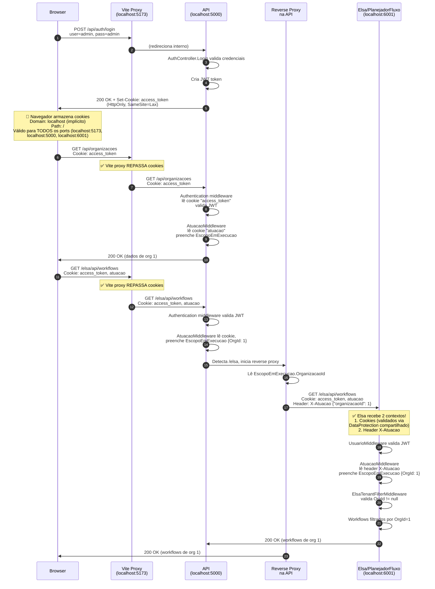

# Autenticação, Autorização e Contexto de Atuação

Este documento descreve como o projeto implementa **autenticação (authentication)**, **autorização (authorization)** e **contexto de atuação (tenant context)** em modo desenvolvimento e produção, com foco na integração com Elsa.

> ⚠️ **LEITURA RECOMENDADA:** Comece pela seção [**"O Papel Crítico do Proxy Reverso"**](#-o-papel-crítico-do-proxy-reverso) abaixo. A segurança do compartilhamento de autenticação e contexto entre a API e Elsa depende inteiramente de como o proxy é configurado em desenvolvimento e produção.

## 🔐 O Papel Crítico do Proxy Reverso

A arquitetura de **compartilhamento de autenticação, autorização e contexto** entre a API principal e o Elsa depende criticamente de **dois proxies em desenvolvimento** e **um proxy dedicado em produção**, cada um com papel específico:

```
┌─────────────────────────────────────────────────────────────────────┐
│ DESENVOLVIMENTO: 2 PROXIES                                          │
├─────────────────────────────────────────────────────────────────────┤
│ 1️⃣ VITE PROXY (localhost:5173)                                      │
│    └─ Redireciona frontend para API + Elsa                          │
│    └─ Papel: Unificar origins, compartilhar cookies                 │
│                                                                     │
│ 2️⃣ API PROXY (localhost:5000)                                       │
│    └─ Redireciona requisições /elsa/* para Elsa                    │
│    └─ Papel: Propagar contexto de tenant via headers               │
├─────────────────────────────────────────────────────────────────────┤
│ PRODUÇÃO: 1 PROXY DEDICADO (Nginx/HAProxy/APIGateway)              │
│    └─ Valida JWT, extrai OrganizacaoId, filtra por tenant          │
└─────────────────────────────────────────────────────────────────────┘
```

### Desenvolvimento: 2 Proxies Coordenados

#### 1️⃣ Proxy Vite (Frontend)

**Arquivo:** [src/interface_grafica/web/vite.config.js](src/interface_grafica/web/vite.config.js)

**Papel:** Redirecionar requisições HTTP de localhost:5173 para localhost:5000 (API) e localhost:6001 (Elsa)

**Configurações Necessárias:**

```javascript
server: {
  proxy: {
    // ✅ API endpoints
    '/api': 'http://localhost:5000',        // Controllers da API
    '/auth': 'http://localhost:5000',       // Login/logout/verify
    '/meta': 'http://localhost:5000',       // Metadados
    
    // ✅ Elsa APIs (via API proxy)
    '/elsa': {
      target: 'http://localhost:5000',      // Vai para API, não direto para Elsa!
      changeOrigin: true                    // Muda origin header (permite cookies)
    },
    
    // ✅ Verificação de identidade (JWT claim parsing)
    '/identity': {
      target: 'http://localhost:5000',
      changeOrigin: true
    },
    
    // ✅ Elsa Studio - Assets estáticos (_framework, _content, _blazor)
    '/_framework': { target: 'http://localhost:6001', changeOrigin: true },
    '/_content': { target: 'http://localhost:6001', changeOrigin: true },
    '/_blazor': { target: 'http://localhost:6001', changeOrigin: true },
    
    // ✅ Elsa Studio - Host page (com X-Forwarded-Prefix header)
    '/planejadorDeFluxo': {
      target: 'http://localhost:6001',
      changeOrigin: false,                  // Mantém Host:localhost:5173
      rewrite: (path) => path.replace(/^\/planejadorDeFluxo/, ''),
      headers: {
        'X-Forwarded-Prefix': '/planejadorDeFluxo'  // Diz ao Elsa o prefixo do proxy
      }
    }
  }
}
```

**Por que `changeOrigin` importa:**
- `changeOrigin: true` → Muda header `Origin: localhost:5173` para `Origin: localhost:5000`
- Isso permite que cookies criados por localhost:5000 sejam aceitos no navegador
- Sem isso, o navegador rejeita cookies por violação de SameSite

**Fluxo de Cookies com Vite Proxy:**

```
Navegador (localhost:5173)
    ↓
    └─ GET http://localhost:5173/api/auth/login
       ↓ (Vite proxy redireciona)
    API (localhost:5000)
       └─ Cria cookies: access_token, atuacao
       └─ Set-Cookie headers na resposta
    ↓
Navegador recebe:
    └─ Set-Cookie: access_token (Domain=localhost, Path=/)
    └─ Set-Cookie: atuacao (Domain=localhost, Path=/)
    
Navegador armazena cookies como "localhost" (aplica a TODOS os ports!)
    
Requisição posterior:
    └─ GET http://localhost:5173/elsa/api/workflows
    └─ Cookie: access_token, atuacao (navegador adiciona automaticamente)
       ↓ (Vite proxy redireciona para API, mantém cookies)
    └─ GET http://localhost:5000/elsa/api/workflows
       └─ Cookie: access_token, atuacao (mantido pela Vite proxy)
          ↓ (API proxy redireciona para Elsa)
       └─ GET http://localhost:6001/elsa/api/workflows
          └─ Cookie: access_token, atuacao (mantido pela API proxy)
```

#### 2️⃣ Proxy API (Middleware)

**Arquivo:** [src/retaguarda/Api/Program.cs](src/retaguarda/Api/Program.cs) (linhas ~158-200)

**Papel:** Redirecionar `/elsa/*` para PlanejadorFluxo E propagar contexto de tenant

**Configurações Necessárias:**

```csharp
// Configurar cookies (em appsettings.Development.json ou appsettings.json)
{
  "Jwt": {
    "Key": "change_this_secret_for_prod",
    "Issuer": "Retaguarda",
    "Cookie": {
      "Name": "access_token",
      // ⚠️ NÃO DEFINA Domain para localhost
      // Se Domain="localhost:5000" especificamente, cookies NÃO funcionam em localhost:6001!
      // Deixar vazio = usa domain do servidor (implícito = localhost)
      // "Domain": "",  
      
      "SameSite": "Lax",   // ✅ Necessário para cross-port no mesmo host
      "Secure": false      // ❌ HTTP em dev, ✅ true em produção
    }
  }
}
```

**Middleware de Reverse Proxy:**

```csharp
app.Use(async (context, next) =>
{
    if (context.Request.Path.StartsWithSegments("/elsa", out var remainingPath))
    {
        var targetUrl = $"http://localhost:6001/elsa{remainingPath}{context.Request.QueryString}";
        
        using var httpClient = new HttpClient();
        var targetRequest = new HttpRequestMessage(new HttpMethod(context.Request.Method), targetUrl);
        
        // ✅ Copiar TODOS os headers (incluindo cookies)
        foreach (var header in context.Request.Headers)
        {
            if (!hopByHop.Contains(header.Key))
                targetRequest.Headers.TryAddWithoutValidation(header.Key, header.Value.ToArray());
        }
        
        // ✅ CRÍTICO: Adicionar header X-Atuacao com contexto de tenant
        var escopo = context.RequestServices.GetService(typeof(EscopoEmExecucao)) as EscopoEmExecucao;
        if (escopo?.OrganizacaoId.HasValue == true)
        {
            var atuacao = new { 
                organizacaoId = escopo.OrganizacaoId,
                organizacaoUnidadeId = escopo.OrganizacaoUnidadeId,
                setorId = escopo.SetorId
            };
            targetRequest.Headers.Add("X-Atuacao", JsonSerializer.Serialize(atuacao));
        }
        
        // ✅ Enviar requisição para Elsa e copiar resposta
        var response = await httpClient.SendAsync(targetRequest);
        
        // Copiar response headers (inclusive Set-Cookie se Elsa criar novos cookies)
        foreach (var header in response.Headers)
            context.Response.Headers.TryAdd(header.Key, header.Value.ToArray());
        
        foreach (var header in response.Content.Headers)
            context.Response.Headers.TryAdd(header.Key, header.Value.ToArray());
        
        context.Response.StatusCode = (int)response.StatusCode;
        await response.Content.CopyToAsync(context.Response.Body);
        
        return;  // Não chamar next() - já lidamos com a requisição
    }
    
    await next(context);
});
```

**DataProtection Compartilhado:**

```csharp
// Em Program.cs - API
builder.Services.AddDataProtection()
    .PersistKeysToFileSystem(
        new DirectoryInfo(Path.Combine(builder.Environment.ContentRootPath, "..", "..", "data-protection-keys"))
    )
    .SetApplicationName("Retaguarda");  // ✅ Nome IGUAL em ambos!
```

```csharp
// Em Program.cs - PlanejadorFluxo (Elsa)
builder.Services.AddDataProtection()
    .PersistKeysToFileSystem(
        new DirectoryInfo(Path.Combine(builder.Environment.ContentRootPath, "..", "..", "..", "data-protection-keys"))
    )
    .SetApplicationName("Retaguarda");  // ✅ DEVE ser igual à API!
```

**Por que DataProtection compartilhado é crítico:**
- Cookies `access_token` e `atuacao` são validados usando chaves criptográficas
- Se API e Elsa não compartilham as mesmas chaves, não conseguem validar cookies um do outro
- Arquivo `data-protection-keys/key-*.xml` contém essas chaves

---

### 📊 Fluxo de Autenticação (Gráfico de Sequência)



---

### ⚠️ Configurações que Falham (Troubleshooting)

Quando a autenticação entre Frontend → API → Elsa falha, geralmente é uma dessas razões:

| # | Problema | Sintomas | Solução |
|---|----------|----------|---------|
| 1️⃣ | **Cookie criado com Domain específico** | Cookies em localhost:5000, mas não aparecem em localhost:6001 | Não defina `Domain` em `CookieOptions`. Deixar vazio = domain implícito do servidor |
| 2️⃣ | **SameSite=Strict sem HTTPS** | Cookies não são enviados entre ports diferentes | Use `SameSite=Lax` (permitido) ou `SameSite=None` + `Secure=true` em HTTPS |
| 3️⃣ | **Secure=true em HTTP** | Navegador rejeita cookies por protocolo inseguro | Em desenvolvimento: `Secure=false`. Em produção: `Secure=true` + HTTPS obrigatório |
| 4️⃣ | **Vite proxy sem changeOrigin** | CORS error, cookies rejeitados | Configure `changeOrigin: true` para endpoints que criam cookies |
| 5️⃣ | **DataProtection keys não compartilhadas** | Elsa não consegue validar cookies criados pela API | Ambos devem usar mesma pasta (`data-protection-keys/`) e `.SetApplicationName("Retaguarda")` |
| 6️⃣ | **Proxy não repassa headers** | Headers como Authorization perdidos entre services | Middleware deve fazer loop em `context.Request.Headers` e copiar todos |
| 7️⃣ | **Header X-Atuacao não adicionado** | Elsa não sabe qual OrganizacaoId usar | API proxy deve ler `EscopoEmExecucao` e serializar em `X-Atuacao` |
| 8️⃣ | **Hosts diferentes** | localhost vs 127.0.0.1 vs yourdomain.com | Cookies criados em localhost NÃO funcionam em 127.0.0.1. Use SEMPRE o mesmo host |
| 9️⃣ | **Port diferente em produção** | Cookies localhost:5000 não funcionam em servidor:5000 | Em produção, usar proxy dedicado (Nginx) que termina SSL e roteia internamente |
| 🔟 | **Path-based cookies** | Se cookie tem Path=/api, não funciona em /elsa | Deixar Path=/. AtuacaoMiddleware lê de qualquer Path |

---

### 🚀 Passos Práticos para Desenvolvimento

**Pré-requisitos:**
- ✅ PostgreSQL 14+ rodando em localhost:5432
- ✅ .NET 9.0 SDK instalado
- ✅ Node.js 18+ instalado
- ✅ Pasta `data-protection-keys/` criada no workspace root

**Passo 1: Iniciar API**

```powershell
cd c:\PROJETOS\proposta_arquitetura_grp\src\retaguarda\Api

dotnet restore
dotnet build

# Executar migrations (primeira vez)
dotnet ef database update -p ..\Persistencia --context Retaguarda.Persistencia.POSTGRESQL.ApplicationDbContext

# Iniciar API (escuta em localhost:5000)
dotnet run --configuration Development
```

**Verificar:**
```bash
curl -I http://localhost:5000/health
# HTTP/1.1 200 OK
```

**Passo 2: Iniciar Elsa/PlanejadorFluxo**

```powershell
cd c:\PROJETOS\proposta_arquitetura_grp\src\retaguarda\Retaguarda.PlanejadorFluxo

dotnet restore
dotnet build

# Executar migrations (primeira vez)
dotnet ef database update -p ..\Persistencia

# Iniciar Elsa (escuta em localhost:6001)
dotnet run --configuration Development
```

**Verificar:**
```bash
curl -I http://localhost:6001/health
# HTTP/1.1 200 OK

curl -I http://localhost:6001/studio
# HTTP/1.1 200 OK (Elsa Studio frontend)
```

**Passo 3: Iniciar Frontend (Vite proxy)**

```powershell
cd c:\PROJETOS\proposta_arquitetura_grp\src\interface_grafica\web

npm install
npm run dev
# Escuta em localhost:5173
# Proxy ativo: /api → localhost:5000, /elsa → localhost:5000, /_framework → localhost:6001
```

**Verificar:**
```bash
# No navegador:
# http://localhost:5173
# 
# Devtools → Network:
# POST http://localhost:5173/api/auth/login
#   → Vite proxy redireciona para localhost:5000/api/auth/login
#   → Response contém Set-Cookie: access_token, atuacao
#
# GET http://localhost:5173/api/organizacoes
#   → Cookie: access_token, atuacao adicionado automaticamente
#   → Vai para localhost:5000/api/organizacoes
```

**Passo 4: Testar Isolamento de Tenant**

```powershell
# 1. Abrir 2 abas no navegador

# Aba 1 - Organização A (admin user)
# http://localhost:5173
# Login: admin/admin
# Criar workflow no Elsa Studio: /planejadorDeFluxo
#   Workflow.Name = "WF-ORG-A"

# Aba 2 - Organização B (usuário diferente)
# http://localhost:5173
# Logout e login como outro usuário (ex: user2/pass2)
# Ir para Elsa Studio: /planejadorDeFluxo
# 
# ⚠️ VERIFICAR: Workflow "WF-ORG-A" NÃO aparece!
# ✅ Se isolamento funciona: ElsaTenantFilterMiddleware bloqueia workflows de outra org
```

**Passo 5: Validar Cookies em DevTools**

```
Navegador F12 → Application/Storage → Cookies → http://localhost:5173

access_token:
  Value: eyJhbGc...
  Domain: localhost
  Path: /
  Secure: ❌ (HTTP em dev)
  HttpOnly: ✅ (não vê conteúdo em console.log)
  SameSite: Lax ✅

atuacao:
  Value: {"organizacaoId": 1, ...}
  Domain: localhost
  Path: /
  Secure: ❌ (HTTP em dev)
  HttpOnly: ✅
  SameSite: Lax ✅
```

---

## Visão Geral da Arquitetura

```
┌─────────────────────────────────────────────────────────────┐
│  FRONTEND (localhost:5173)                                  │
│  • Login com credentials (admin/admin)                      │
│  • Recebe JWT token + contexto de atuação                   │
│  • Armazena token em cookie HttpOnly (access_token)         │
│  • Armazena contexto em cookie (atuacao)                    │
└──────────────────┬──────────────────────────────────────────┘
                   │
    GET / POST requests com cookies
                   │
                   ▼
┌─────────────────────────────────────────────────────────────┐
│  API (localhost:5000)                                       │
│  ┌─────────────────────────────────────────────────────────┤
│  │ MIDDLEWARE PIPELINE                                     │
│  │ 1. Authentication (JWT do cookie access_token)          │
│  │ 2. UsuarioMiddleware (extrai usuário autenticado)       │
│  │ 3. AtuacaoMiddleware (extrai OrganizacaoId/etc)         │
│  │    └─ Preenche EscopoEmExecucao                         │
│  │ 4. Authorization (verifica [Authorize])                 │
│  └─────────────────────────────────────────────────────────┤
│                                                             │
│  • Controllers filtram dados por OrganizacaoId (tenant)     │
│  • Reverse proxy para /elsa/* → PlanejadorFluxo            │
│  • Adiciona header X-Atuacao ao proxy (NOVO)               │
└──────────────────┬──────────────────────────────────────────┘
                   │ HTTP + Cookie + Header X-Atuacao
                   ▼
┌─────────────────────────────────────────────────────────────┐
│  PLANEJADOR FLUXO / ELSA (localhost:6001)                   │
│  ┌─────────────────────────────────────────────────────────┤
│  │ MIDDLEWARE PIPELINE                                     │
│  │ 1. Authentication (JWT validado)                        │
│  │ 2. UsuarioMiddleware (extrai usuário)                   │
│  │ 3. AtuacaoMiddleware (lê header X-Atuacao)             │
│  │    └─ Preenche EscopoEmExecucao                         │
│  │ 4. ElsaTenantFilterMiddleware (valida tenant)          │
│  │ 5. Authorization                                        │
│  └─────────────────────────────────────────────────────────┤
│                                                             │
│  • Atividades Elsa usam EscopoEmExecucao.OrganizacaoId     │
│  • TenantAwareActivity resolve tenant de variáveis/claims   │
│  • Workflows isolados por OrganizacaoId (novo)            │
│  • Banco compartilhado mas dados filtrados                  │
└─────────────────────────────────────────────────────────────┘
```

## Fluxo de Autenticação

### 1. Login (POST /api/auth/login)

```http
POST http://localhost:5000/api/auth/login
Content-Type: application/json

{
  "usuario": "admin",
  "senha": "admin"
}
```

**Resposta (201 Created):**
```json
{
  "token": "eyJhbGc...",
  "usuario": "admin",
  "organizacaoId": 1,
  "organizacaoUnidadeId": null,
  "setorId": null,
  "expiracao": "2026-08-14T23:00:00Z"
}
```

**Side Effects:**
- 🍪 Cookie `access_token` criado (HttpOnly, Secure em produção)
- 🍪 Cookie `atuacao` criado com contexto: `{"organizacaoId": 1, ...}`
- No frontend, token armazenado em memória para requisições

### 2. Fluxo de Requisições Autenticadas

**DESENVOLVIMENTO:**
```
Frontend (cookie access_token + atuacao)
    ↓
API.AtuacaoMiddleware
    ├─ Lê cookie "atuacao"
    ├─ Preenche EscopoEmExecucao { OrganizacaoId: 1 }
    └─ Armazena em HttpContext.Items["escopo.organizacaoId"]
    ↓
Controllers (filtram por EscopoEmExecucao.OrganizacaoId)
    ↓
Reverse Proxy para /elsa/*
    ├─ Copia cookies (access_token, atuacao)
    ├─ Adiciona header X-Atuacao: {"organizacaoId": 1}  (NOVO)
    └─ Envia para PlanejadorFluxo
    ↓
PlanejadorFluxo.AtuacaoMiddleware
    ├─ Encontra header X-Atuacao
    ├─ Preenche EscopoEmExecucao
    └─ Atividades Elsa usam este contexto
```

## Componentes Principais

### A. AtuacaoMiddleware

**Arquivo:** [src/retaguarda/Api/Middleware/AtuacaoMiddleware.cs](../src/retaguarda/Api/Middleware/AtuacaoMiddleware.cs)

**Responsabilidades:**
1. Ler contexto de tenant de:
   - Cookie `atuacao` (prioridade)
   - Header `X-Atuacao` (fallback)
2. Parse JSON: `{"organizacaoId": 1, "organizacaoUnidadeId": 2, "setorId": 3}`
3. Preencher `EscopoEmExecucao` (escoped service)
4. Armazenar em `HttpContext.Items` para acesso sem referências de projeto

**Estratégia de Parsing:**

```csharp
// Cookie/Header pode estar em 2 formatos:

// Formato 1: JSON
atuacao = {"organizacaoId": 1, "organizacaoUnidadeId": 2}

// Formato 2: Key-Value
atuacao = organizacaoId=1;organizacaoUnidadeId=2
```

### B. EscopoEmExecucao

**Arquivo:** [src/retaguarda/Servicos/EscopoEmExecucao.cs](../src/retaguarda/Servicos/EscopoEmExecucao.cs)

```csharp
public class EscopoEmExecucao
{
    public long? OrganizacaoId { get; set; }
    public long? OrganizacaoUnidadeId { get; set; }
    public long? SetorId { get; set; }
}
```

**Ciclo de Vida:** Scoped (criado por requisição, destruído ao final)

**Uso:**
```csharp
// Em um repositório ou serviço
public class OrganizacaoRepositorio
{
    private readonly IApplicationDbContext _context;
    private readonly EscopoEmExecucao _escopo;

    public OrganizacaoRepositorio(IApplicationDbContext context, EscopoEmExecucao escopo)
    {
        _context = context;
        _escopo = escopo;
    }

    public async Task<List<Organizacao>> ListarAsync()
    {
        // Filtrar automaticamente por OrganizacaoId do usuário
        return await _context.Organizacoes
            .Where(o => o.OrganizacaoId == _escopo.OrganizacaoId)
            .ToListAsync();
    }
}
```

### C. TenantAwareActivity (Elsa)

**Arquivo:** [src/retaguarda/Retaguarda.PlanejadorFluxo/Atividades/TenantAwareActivity.cs](../src/retaguarda/Retaguarda.PlanejadorFluxo/Atividades/TenantAwareActivity.cs)

Classe base para atividades Elsa que precisam resolver contexto de tenant:

```csharp
public abstract class TenantAwareActivity : Activity
{
    protected (long? OrganizacaoId, long? UnidadeId, long? SetorId) 
        ResolveTenant(ActivityExecutionContext context)
    {
        // 1. Tenta ler de variáveis do workflow
        // 2. Fallback para claims do usuário
        // 3. Fallback para HttpContext.Items (via header X-Atuacao)
        
        var httpAccessor = context.GetService<IHttpContextAccessor>();
        var orgId = long.TryParse(
            httpAccessor?.HttpContext?.Items["elsa.organizacaoId"]?.ToString(),
            out var id) ? id : null;
        
        return (orgId, unidadeId, setorId);
    }
}
```

## Configuração do Proxy Reverso em Produção

### Opção 1: Nginx em Servidor Dedicado

**Arquivo:** `/etc/nginx/sites-available/grp-proxy.conf`

```nginx
# Validar JWT e extrair OrganizacaoId
auth_request /auth/verify-token;

upstream api_backend {
    least_conn;  # Load balancing por menor conexão ativa
    server api-server-1:5000 max_fails=3 fail_timeout=30s;
    server api-server-2:5000 max_fails=3 fail_timeout=30s;
}

upstream elsa_backend {
    server elsa-server-1:6001;
    server elsa-server-2:6001;
}

server {
    listen 443 ssl http2;
    server_name yourdomain.com api.yourdomain.com;
    
    # Certificado SSL (Let's Encrypt)
    ssl_certificate /etc/letsencrypt/live/yourdomain.com/fullchain.pem;
    ssl_certificate_key /etc/letsencrypt/live/yourdomain.com/privkey.pem;
    ssl_protocols TLSv1.2 TLSv1.3;
    ssl_ciphers HIGH:!aNULL:!MD5;
    ssl_prefer_server_ciphers on;
    
    # Security headers
    add_header Strict-Transport-Security "max-age=31536000; includeSubDomains" always;
    add_header X-Content-Type-Options "nosniff" always;
    add_header X-Frame-Options "DENY" always;
    add_header X-XSS-Protection "1; mode=block" always;
    
    # Rate limiting por tenant
    limit_req_zone $http_x_organization_id zone=per_tenant:10m rate=100r/s;
    limit_req zone=per_tenant burst=200 nodelay;
    
    # ============================================
    # API PRINCIPAL
    # ============================================
    location / {
        proxy_pass http://api_backend;
        proxy_http_version 1.1;
        proxy_set_header Connection "";
        
        # Headers originais
        proxy_set_header Host $host;
        proxy_set_header X-Real-IP $remote_addr;
        proxy_set_header X-Forwarded-For $proxy_add_x_forwarded_for;
        proxy_set_header X-Forwarded-Proto $scheme;
        
        # ✅ CONTEXTO: Passar OrganizacaoId extraído do JWT
        proxy_set_header X-Organization-Id $http_x_organization_id;
        
        # Timeouts
        proxy_connect_timeout 5s;
        proxy_send_timeout 60s;
        proxy_read_timeout 60s;
    }
    
    # ============================================
    # ELSA / PLANEJADOR DE FLUXO
    # ============================================
    location /elsa/ {
        # ✅ AUTENTICAÇÃO: Verificar JWT antes de rotear
        auth_request /auth/verify-token;
        auth_request_set $org_id $upstream_http_x_organization_id;
        auth_request_set $user_id $upstream_http_x_user_id;
        
        proxy_pass http://elsa_backend;
        proxy_http_version 1.1;
        proxy_set_header Upgrade $http_upgrade;
        proxy_set_header Connection "upgrade";  # WebSockets para Elsa Studio
        
        # ✅ CONTEXTO: Adicionar header X-Atuacao com OrganizacaoId
        # Formado como JSON para parsing no PlanejadorFluxo
        proxy_set_header X-Atuacao '{"organizacaoId": $org_id, "userId": $user_id}';
        proxy_set_header X-Organization-Id $org_id;
        proxy_set_header X-User-Id $user_id;
        
        # Headers de contexto
        proxy_set_header Host $host;
        proxy_set_header X-Real-IP $remote_addr;
        proxy_set_header X-Forwarded-For $proxy_add_x_forwarded_for;
        proxy_set_header X-Forwarded-Proto $scheme;
        
        # ⚠️ SEGURANÇA: NÃO passar Authorization header (JWT já foi validado no proxy)
        # Assim evitamos que Elsa valide novamente (economia de CPU)
        # proxy_set_header Authorization "";
        
        # Timeouts maiores para Elsa (workflows podem demorar)
        proxy_connect_timeout 10s;
        proxy_send_timeout 300s;
        proxy_read_timeout 300s;
    }
    
    # ============================================
    # VERIFICAÇÃO DE JWT
    # ============================================
    location = /auth/verify-token {
        internal;  # Apenas acessível internamente pelo nginx
        
        proxy_pass http://api_backend/api/auth/verify-jwt;
        proxy_http_version 1.1;
        proxy_set_header Connection "";
        
        # Passar Authorization header para validação
        proxy_set_header Authorization $http_authorization;
        
        # Se falhar, retornar 401
        proxy_pass_request_body off;
        proxy_set_header Content-Length "";
    }
    
    # ============================================
    # HEALTH CHECK
    # ============================================
    location /health {
        proxy_pass http://api_backend/health;
        access_log off;
    }
}

# Redirect HTTP para HTTPS
server {
    listen 80;
    server_name yourdomain.com *.yourdomain.com;
    return 301 https://$server_name$request_uri;
}
```

**Aplicar:**
```bash
sudo nginx -t  # Testar configuração
sudo systemctl reload nginx
```

---

### Opção 2: Docker Compose (Desenvolvimento → Produção)

**Arquivo:** `docker-compose.prod.yml`

```yaml
version: '3.8'

services:
  # ============================================
  # NGINX - PROXY REVERSO
  # ============================================
  nginx-proxy:
    image: nginx:latest
    container_name: grp-nginx-proxy
    ports:
      - "80:80"
      - "443:443"
    volumes:
      - ./nginx.conf:/etc/nginx/nginx.conf:ro
      - ./ssl:/etc/nginx/ssl:ro  # Certificados
      - /var/log/nginx:/var/log/nginx
    environment:
      - API_BACKEND=api:5000
      - ELSA_BACKEND=elsa:6001
    depends_on:
      - api
      - elsa
    networks:
      - grp-network

  # ============================================
  # API PRINCIPAL
  # ============================================
  api:
    image: grp-api:latest
    container_name: grp-api
    ports:
      - "5000:5000"  # Apenas interno (não exposto)
    environment:
      - ASPNETCORE_ENVIRONMENT=Production
      - ASPNETCORE_URLS=http://+:5000
      - ConnectionStrings__DefaultConnection=${DB_CONNECTION_STRING}
      - Jwt__Key=${JWT_KEY}
      - Jwt__Issuer=GRP
    depends_on:
      - postgres
    networks:
      - grp-network
    healthcheck:
      test: ["CMD", "curl", "-f", "http://localhost:5000/health"]
      interval: 10s
      timeout: 3s
      retries: 3

  # ============================================
  # ELSA / PLANEJADOR DE FLUXO
  # ============================================
  elsa:
    image: grp-elsa:latest
    container_name: grp-elsa
    ports:
      - "6001:6001"  # Apenas interno (não exposto)
    environment:
      - ASPNETCORE_ENVIRONMENT=Production
      - ASPNETCORE_URLS=http://+:6001
      - Elsa__ConnectionStrings__DefaultConnection=${DB_CONNECTION_STRING}
      - Jwt__Key=${JWT_KEY}
    depends_on:
      - postgres
    networks:
      - grp-network
    healthcheck:
      test: ["CMD", "curl", "-f", "http://localhost:6001/health"]
      interval: 10s
      timeout: 3s
      retries: 3

  # ============================================
  # BANCO DE DADOS (PostgreSQL)
  # ============================================
  postgres:
    image: postgres:15-alpine
    container_name: grp-postgres
    environment:
      - POSTGRES_USER=grp_user
      - POSTGRES_PASSWORD=${DB_PASSWORD}
      - POSTGRES_DB=grp_banco_01
    volumes:
      - postgres-data:/var/lib/postgresql/data
    networks:
      - grp-network
    healthcheck:
      test: ["CMD-SHELL", "pg_isready -U grp_user"]
      interval: 10s
      timeout: 5s
      retries: 5

volumes:
  postgres-data:

networks:
  grp-network:
    driver: bridge
```

**Executar:**
```bash
# Gerar .env com secrets seguros
export JWT_KEY=$(openssl rand -hex 32)
export DB_PASSWORD=$(openssl rand -base64 32)

# Iniciar stack
docker-compose -f docker-compose.prod.yml up -d

# Logs
docker-compose -f docker-compose.prod.yml logs -f nginx-proxy
```

---

### Opção 3: Kubernetes (Escalabilidade em Produção)

**Arquivo:** `k8s/ingress.yaml`

```yaml
apiVersion: networking.k8s.io/v1
kind: Ingress
metadata:
  name: grp-ingress
  namespace: grp-prod
  annotations:
    kubernetes.io/ingress.class: nginx
    cert-manager.io/cluster-issuer: letsencrypt-prod
    # ✅ Rate limiting por tenant
    nginx.ingress.kubernetes.io/limit-rps: "100"
    nginx.ingress.kubernetes.io/limit-connections: "10"
    # ✅ Security headers
    nginx.ingress.kubernetes.io/configuration-snippet: |
      more_set_headers "X-Frame-Options: DENY";
      more_set_headers "X-Content-Type-Options: nosniff";
spec:
  tls:
    - hosts:
        - yourdomain.com
        - api.yourdomain.com
      secretName: grp-tls-cert
  rules:
    # API Principal
    - host: api.yourdomain.com
      http:
        paths:
          - path: /
            pathType: Prefix
            backend:
              service:
                name: grp-api-service
                port:
                  number: 5000
    
    # Elsa (com auth e context propagation)
    - host: api.yourdomain.com
      http:
        paths:
          - path: /elsa
            pathType: Prefix
            backend:
              service:
                name: grp-elsa-service
                port:
                  number: 6001
---

# ============================================
# CONFIGMAP - Configuração do Nginx
# ============================================
apiVersion: v1
kind: ConfigMap
metadata:
  name: nginx-elsa-config
  namespace: grp-prod
data:
  elsa-upstream.conf: |
    # ✅ Extrair OrganizacaoId do JWT no header
    location /elsa/ {
        # Validar JWT antes de rotear
        auth_request /auth/verify;
        auth_request_set $org_id $upstream_http_x_organization_id;
        
        # Rotear para Elsa
        proxy_pass http://grp-elsa-service:6001;
        
        # ✅ CONTEXTO: Propagar OrganizacaoId
        proxy_set_header X-Atuacao '{"organizacaoId": $org_id}';
        proxy_set_header X-Organization-Id $org_id;
        
        # WebSockets support
        proxy_http_version 1.1;
        proxy_set_header Upgrade $http_upgrade;
        proxy_set_header Connection "upgrade";
    }

---

# ============================================
# SERVICE - API
# ============================================
apiVersion: v1
kind: Service
metadata:
  name: grp-api-service
  namespace: grp-prod
spec:
  selector:
    app: grp-api
  ports:
    - protocol: TCP
      port: 5000
      targetPort: 5000
  type: ClusterIP

---

# ============================================
# SERVICE - ELSA
# ============================================
apiVersion: v1
kind: Service
metadata:
  name: grp-elsa-service
  namespace: grp-prod
spec:
  selector:
    app: grp-elsa
  ports:
    - protocol: TCP
      port: 6001
      targetPort: 6001
  type: ClusterIP
```

**Aplicar:**
```bash
kubectl apply -f k8s/ingress.yaml
kubectl get ingress -n grp-prod
```

---

### Checklist de Configuração em Produção

| Item | Validação | Comando |
|---|---|---|
| **HTTPS** | ✅ TLS 1.2+ | `curl -I https://yourdomain.com` |
| **JWT Key** | ✅ 256-bit segura | Armazenar em secrets manager |
| **Rate Limiting** | ✅ 100 req/s por tenant | Monitorar alertas no Prometheus |
| **Logging Centralizado** | ✅ ELK/Splunk/Datadog | `docker logs grp-nginx-proxy` |
| **Tenant Isolation** | ✅ Workflows ORG A ≠ ORG B | Testar login cruzado |
| **Health Checks** | ✅ API + Elsa respondendo | `kubectl get pods` |
| **Backup BD** | ✅ Automático diário | Verificar snapshots |
| **Certificado Renovação** | ✅ Automática (cert-manager) | `kubectl get certificate` |

## Desenvolvimento vs. Produção

### Desenvolvimento (localhost)

| Aspecto | Implementação |
|---------|---------------|
| **HTTPS** | ❌ Desabilitado (HTTP) |
| **Cookie Secure** | ❌ Falso (funciona em HTTP) |
| **JWT Key** | 🔑 Padrão: `"change_this_secret_for_prod"` |
| **CORS** | ✅ Permissivo: `AllowAnyOrigin()` |
| **Credenciais Padrão** | ✅ `admin/admin` (seeded no banco) |
| **Isolamento Elsa** | ⚠️ Novo (middleware implementado) |
| **Reverse Proxy** | ✅ API (5000) → PlanejadorFluxo (6001) |
| **Header X-Atuacao** | ✅ Adicionado no proxy (NOVO) |

**Como executar:**
```powershell
cd c:\PROJETOS\proposta_arquitetura_grp
.\iniciar-em-modo-deselvolvimento.ps1
```

**Endpoints:**
- API: `http://localhost:5000`
- Elsa Studio: `http://localhost:6001/studio`
- Frontend: `http://localhost:5173`

### Produção

| Aspecto | Recomendação |
|---------|---|
| **HTTPS** | ✅ **Obrigatório** - Use certificado válido (Let's Encrypt) |
| **Cookie Secure** | ✅ **Obrigatório** - `Secure; HttpOnly; SameSite=Strict` |
| **JWT Key** | ✅ **Obrigatório** - Use 256-bit key segura (não hardcoded) |
| **CORS** | ⚠️ Restritivo - Apenas domínios autorizados |
| **Credenciais Padrão** | ❌ **Desabilitar** - Mudar `admin/admin` |
| **Isolamento Elsa** | ✅ **Crítico** - OrganizacaoId obrigatório em todas as requests |
| **Autenticação Multi-Tenant** | ✅ Validar OrganizacaoId do usuário vs. dados |
| **Secret Management** | ✅ Usar Key Vault / Secrets Manager (não `appsettings.json`) |
| **Logging & Audit** | ✅ Log todas as operações Elsa com OrganizacaoId |

**Variáveis de Ambiente Essenciais:**

```bash
# Autenticação
ASPNETCORE_ENVIRONMENT=Production
Jwt__Key=<64-char-random-hex-key>
Jwt__Issuer=YourOrgName

# Banco de Dados
Persistence__Provider=Postgres  # ou MySql
ConnectionStrings__DefaultConnection=<connection-string>

# Segurança
ASPNETCORE_URLs=https://+:443
ASPNETCORE_HTTPS_PORT=443
ASPNETCORE_Kestrel__Certificates__Default__Path=/etc/certs/cert.pem
ASPNETCORE_Kestrel__Certificates__Default__KeyPath=/etc/certs/key.pem

# Elsa/PlanejadorFluxo
Elsa__ConnectionStrings__DefaultConnection=<connection-string>

# CORS
Cors__AllowedOrigins=https://yourdomain.com
```

> **ℹ️ IMPORTANTE:** A segurança em produção depende **criticamente** da configuração correta do proxy reverso. Veja a seção [**Configuração do Proxy Reverso em Produção**](#configuração-do-proxy-reverso-em-produção) acima para:
> - ✅ Validar JWT no proxy (não na aplicação)
> - ✅ Extrair e propagar OrganizacaoId via headers
> - ✅ Isolamento de tenant em camadas múltiplas
> - ✅ Exemplos Nginx, Docker Compose e Kubernetes

## Isolamento Multilocatário (Tenant Isolation)

### Estratégia de Isolamento

```
┌─────────────────────────────────┐
│  NÍVEL 1: Autenticação          │
│  ✅ JWT Token com OrganizacaoId │
└─────────────┬───────────────────┘
              ▼
┌─────────────────────────────────┐
│  NÍVEL 2: Contexto de Execução  │
│  ✅ EscopoEmExecucao.OrgId      │
│  ✅ HttpContext.Items           │
└─────────────┬───────────────────┘
              ▼
┌─────────────────────────────────┐
│  NÍVEL 3: Filtro de Dados       │
│  ✅ Controllers filtram queries │
│  ✅ Repositórios filtram por OrgId
│  ✅ DbContext filtra automático │
└─────────────┬───────────────────┘
              ▼
┌─────────────────────────────────┐
│  NÍVEL 4: Isolamento Elsa       │
│  ✅ Header X-Atuacao propagado  │
│  ✅ ElsaTenantFilterMiddleware   │
│  ✅ OrganizacaoId em workflows  │
│  ✅ TenantAwareActivity resolve  │
└─────────────────────────────────┘
```

### Validações de Segurança

**Em Controllers:**
```csharp
[ApiController]
[Route("api/[controller]")]
[Authorize]  // ← JWT obrigatório
public class OrganizacoesController
{
    private readonly EscopoEmExecucao _escopo;

    [HttpGet("{id}")]
    public async Task<ActionResult<OrganizacaoDto>> GetById(long id)
    {
        var org = await _organizacaoRepository.GetByIdAsync(id);
        
        // ✅ Validar: usuário só vê dados da sua organização
        if (org.OrganizacaoId != _escopo.OrganizacaoId)
        {
            return Forbid("Acesso negado: organização diferente");
        }
        
        return Ok(org);
    }
}
```

**Em Atividades Elsa:**
```csharp
[Activity("Retaguarda", "Organização", "Cria nova organização")]
public class CriarOrganizacaoAtividade : TenantAwareActivity
{
    protected override async ValueTask ExecuteAsync(ActivityExecutionContext context)
    {
        var (orgId, _, _) = ResolveTenant(context);
        
        // ✅ Validar: atividade executa apenas no contexto de tenant
        if (!orgId.HasValue)
        {
            throw new InvalidOperationException("OrganizacaoId obrigatório para criar organização");
        }
        
        // Criar organização no contexto de orgId
        var dto = new OrganizacaoDto { Nome = "Nova Org" };
        var result = await _orgService.CriarAsync(dto);
        
        context.Set(OrganizacaoId, result.Id);
    }
}
```

## Múltiplos Frontends (Microfrontend & Microserviços)

Esta arquitetura de autenticação compartilhada viabiliza uso de **múltiplos frontends independentes** (Microfrontend/Micro Apps):

### Padrão: Contexto Centralizado + APIs Agnósticas

```
┌─────────────────────────────────────────────────────────────┐
│  FRONTEND 1: Web (Vite React)          FRONTEND 2: Mobile   │
│  • localhost:5173                      • Native/Flutter      │
│  • Cookie access_token + atuacao       • Header Auth        │
└────────────────┬────────────────────────────┬───────────────┘
                 │                            │
                 └────────────┬────────────────┘
                              │
                    ALL requests to API
                    + Cookie/Header Atuacao
                              │
                              ▼
┌─────────────────────────────────────────────────────────────┐
│  API GATEWAY (localhost:5000)                               │
│  ✅ Validação centralizada de OrganizacaoId                 │
│  ✅ Contexto compartilhado entre frontends                  │
│  ✅ Header X-Atuacao propagado para microsserviços         │
└────────────┬───────────────────────┬───────────────────────┘
             │                       │
    ┌────────▼────────┐   ┌────────▼────────┐
    │  Microserviço 1 │   │  Microserviço 2 │
    │  (Org Service)  │   │  (Elsa Flows)   │
    └────────────────┘   └────────────────┘
```

### Benefícios:

- ✅ **Separação de Responsabilidades:** Cada frontend gerencia sua UI
- ✅ **Reutilização de Contexto:** Todos compartilham `OrganizacaoId`
- ✅ **Escalabilidade:** Fácil adicionar novos frontends/microsserviços
- ✅ **Coexistência:** Web + Mobile + Desktop no mesmo tenant
- ✅ **Headers Agnósticos:** Qualquer cliente (web, mobile, IoT) passa `X-Atuacao`

### Exemplo: Frontend Mobile + Elsa

```
Mobile App (Flutter)
    │
    ├─ POST /api/auth/login
    │   ← Recebe: JWT token + organizacaoId
    │
    ├─ GET /api/organizacoes
    │   Header: Authorization: Bearer <token>
    │   ← Retorna: Lista de organizações (filtrada por tenant)
    │
    └─ POST /elsa/api/workflow-instances
        Header: Authorization: Bearer <token>
        Header: X-Atuacao: {"organizacaoId": 1}
        ← Executa: Workflow no contexto de tenant
```

O middleware de contexto valida que:
- Token é válido
- OrganizacaoId do token = OrganizacaoId da requisição
- Dados retornados = apenas da organização do usuário

---

## Próximos Passos

### Desenvolvimento:
1. ✅ Aplicar migrations para adicionar `OrganizacaoId` ao schema Elsa
   ```powershell
   cd src\retaguarda\Api
   dotnet ef database update -p ..\Persistencia -s . --context Retaguarda.Persistencia.POSTGRESQL.ApplicationDbContext
   ```

2. ✅ Testar isolamento entre organizações no Elsa Studio

3. ✅ Validar que workflows de ORG A não aparecem em ORG B

### Produção:
1. ✅ Configurar HTTPS com certificado
2. ✅ Definir JWT Key segura (via secrets manager)
3. ✅ Habilitar validação rigorosa de tenant
4. ✅ Implementar audit logging de acesso a workflows
5. ✅ Testar com múltiplas organizações

---

## Referências

- [DESENVOLVIMENTO_INSTRUCOES.md](../DESENVOLVIMENTO_INSTRUCOES.md) - Como rodar em desenvolvimento
- [Integração com Elsa](../DESENVOLVIMENTO_INSTRUCOES.md#integração-com-elsa-orquestração-de-processos) - Arquitetura de atividades Elsa
- `/memories/repo/elsa-tenant-isolation-analysis.md` - Análise técnica de isolamento (salva em memória)
