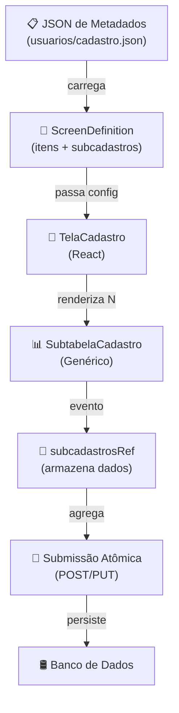
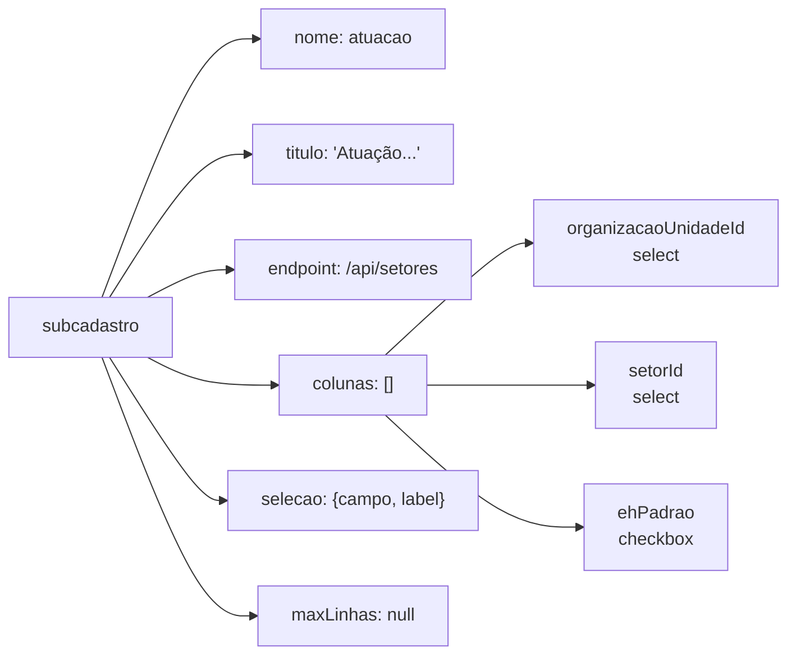
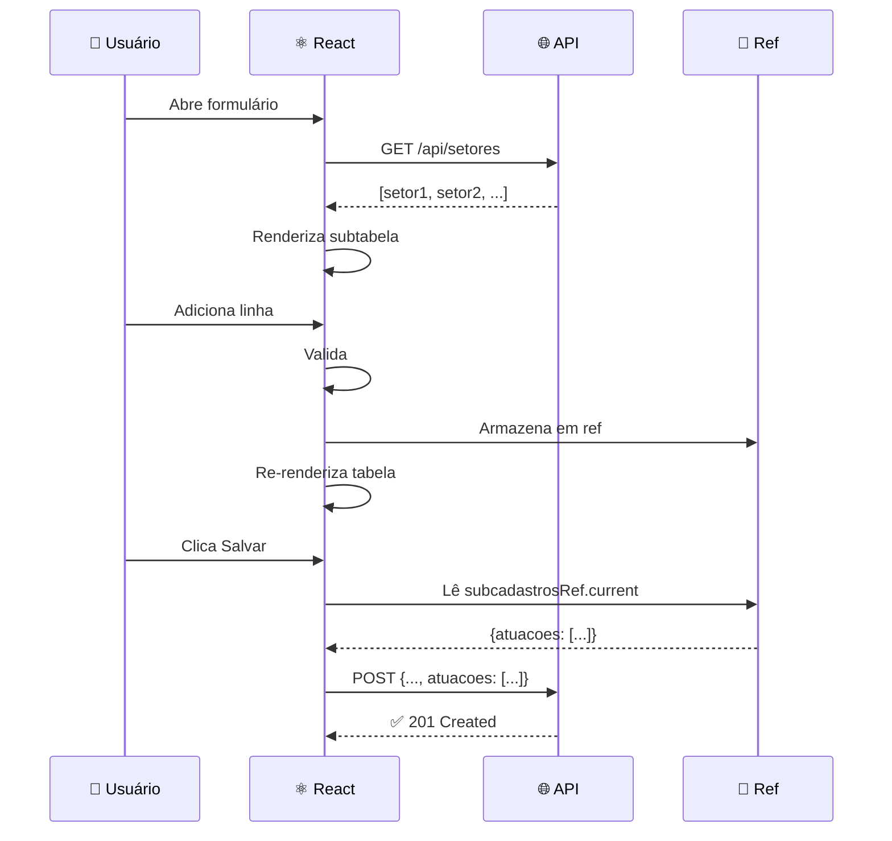
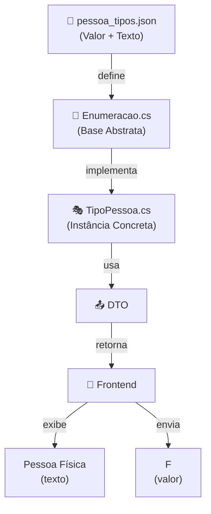
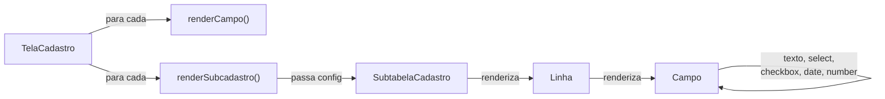
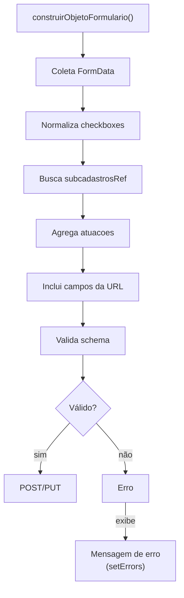
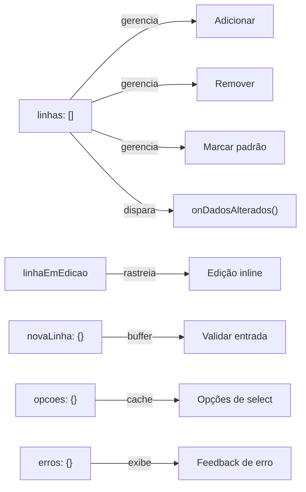
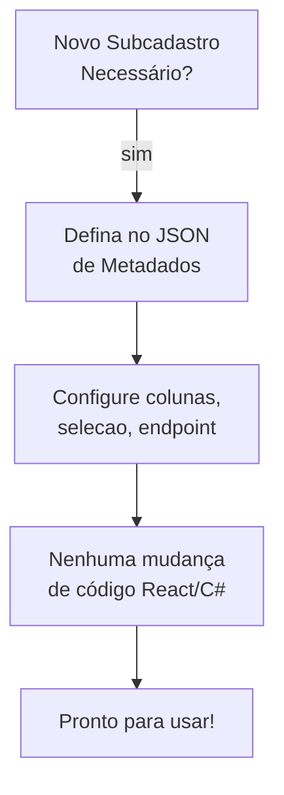
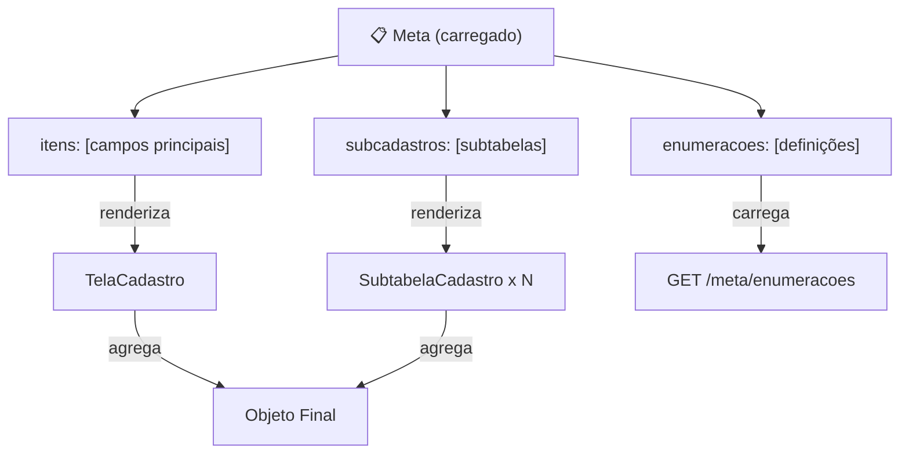
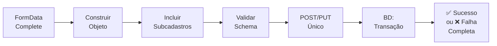

# Diagramas de Arquitetura - Subcadastros Genéricos

## 1. Fluxo Geral de Dados

## 2. Estrutura de Subcadastro (JSON)

## 3. Ciclo de Vida de SubtabelaCadastro

## 4. Arquitetura de Enumerações

## 5. Componentes React

## 6. Fluxo de Validação e Submissão

## 7. Estados e Eventos SubtabelaCadastro

## 8. Padrão de Reutilização

## 9. Integração com Metadados

## 10. Atomicidade de Transação

---

## Legenda de Componentes

| Símbolo | Significado |
|---------|------------|
| 📋 | Arquivo de Configuração / JSON |
| 🎯 | Classe / Contrato |
| 📱 | Componente React |
| 💾 | Armazenamento / Referência |
| 🚀 | Operação / Ação |
| 🛢️ | Banco de Dados |
| 🔧 | Base / Interface |
| 🎭 | Implementação Concreta |
| 📤 | Transferência de Dados |
| 🎨 | Interface Visual |
| 📊 | Dados / Estado |
| 🌐 | API / Serviço |
| 👤 | Ator / Usuário |
| ⚛️ | React |
| 🔖 | Referência em Memória |
